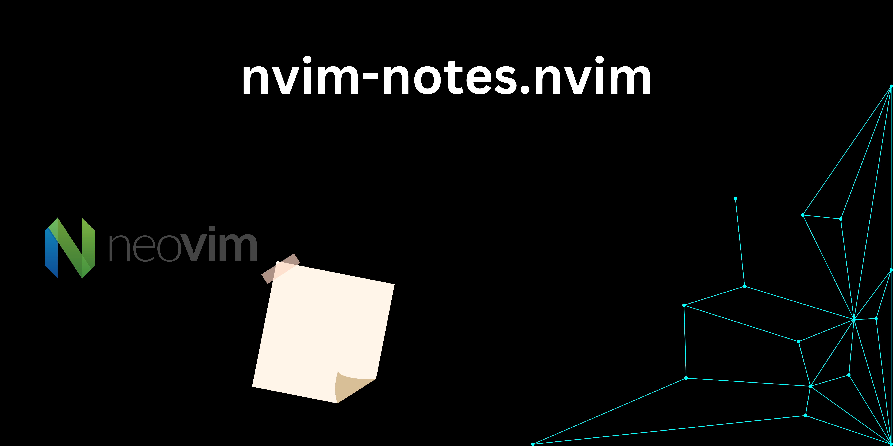

# nvim-notes.nvim



nvim-notes is a simple Neovim plugin for managing notes. It integrates with Telescope.nvim to help you create, search, and manage notes easily within Neovim

## Features

- Create Notes: Quickly create notes with :Notes write.
- Search Notes: Search through your notes with :Notes find using Telescope.
- List Notes: Retrieve a list of all notes with :Notes get.
- Custom Setup: Configure note paths, logging, and more with :Notes setup.


## Installation (Using Lazy.nvim)

Add the following lines to your init to install the plugin with Lazy.nvim.lua:


- Add nvim-notes to your Lazy.nvim setup:

```lua
require("lazy").setup({
  {
    'itsvinayak/nvim-notes.nvim',
    dependencies = {
      'nvim-telescope/telescope.nvim', -- Add Telescope as a dependency
      'folke/which-key.nvim'            -- Add WhichKey as a dependency
    },
    config = function()
      require('notes').setup {
        -- Optional configurations
        path = '~/.my_notes',         -- Custom path for notes
        log_enabled = true,           -- Enable logging
        log_level = 'INFO'            -- Set log level to INFO
        ft = 'txt'                    -- Sets the notes filetype
      }

      -- Setup WhichKey mappings
      if pcall(require, 'which-key') then
        local wk = require 'which-key'
        wk.add {
          ['<leader>n'] = {
            name = 'Notes',
            w = { ':Notes write<CR>', 'Write a new note' },
            f = { ':Notes find<CR>', 'Find notes by title' },
            g = { ':Notes get<CR>', 'Get a list of all notes' },
            s = { ':Notes setup<CR>', 'Setup the notes plugin' },
          },
        }
      end
    end
  },
})
```
- Synchronize Plugins: After adding the above, run:

```
:Lazy sync
```
## Commands
- :Notes write
  Opens a new buffer to create a note. The note is saved in the specified notes directory.
- :Notes find
  Searches for notes using Telescope.
- :Notes get
  Lists all the notes in the notes directory.
- :Notes setup [key=value]
  Configures the plugin (e.g., paths, logging) using key-value pairs.


## Key Mappings

You can add key mappings to your init.lua or Neovim configuration to make working with the plugin easier:

```lua
vim.api.nvim_set_keymap('n', '<leader>nw', ':Notes write<CR>', { noremap = true, silent = true })
vim.api.nvim_set_keymap('n', '<leader>nf', ':Notes find<CR>', { noremap = true, silent = true })
vim.api.nvim_set_keymap('n', '<leader>ng', ':Notes get<CR>', { noremap = true, silent = true })
```

## Configuration

The plugin comes with default settings, which you can customize during setup:

```lua
require('notes').setup {
  path = '~/.notes',               -- Directory where notes are saved
  log_level = 'INFO',              -- Log level: INFO, DEBUG, ERROR, etc.
  log_enabled = false,             -- Enable or disable logging
  ft = 'txt',                      -- Sets the notes filetype
}
```

## Dependencies

- Neovim 0.5+: Make sure you're running Neovim 0.5 or higher.
- Telescope.nvim: This plugin requires Telescope to perform note searches.

## License

This project is licensed under the GNU License. See the LICENSE file for more information.
